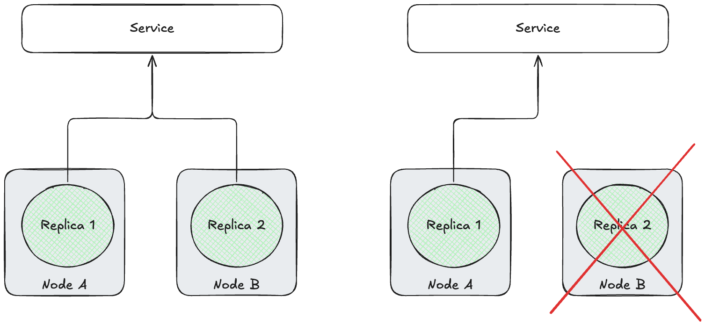

# High Availability

When serving your models in OpenShift, you want to ensure that they aren't going to suddenly stop for any reason, causing downtime. Of course, **you could run several replicas of your model** to help minimize this risk, but there are some additional techniques you can employ.

## Pod Anti-Affinity

"Pod anti-affinity" means to ensure that an application's pod replicas, on OpenShift, are not running on the same node. This protects the application's uptime, in events that cause the node to fail, such as a hardware failure.



While this is an OpenShift concept, it can still be applied to Red Hat OpenShift AI workloads. If you were to deploy several replicas of a small model that can fit on a single GPU, if you have worker nodes with >1 GPUs, there's a chance they are scheduled to the same node, if you haven't configured anti-affinity rules.

### LLMInferenceService Example

Below is an example of how you can set up anti-affinity on your LLMInferenceService CR.

!!! note
    This will need to be added to the CR after deploying the model, it cannot be set up in the UI (as of RHOAI 3.5.0). 

```yaml
apiVersion: serving.kserve.io/v1alpha1
kind: LLMInferenceService
metadata:
  name: qwen3
spec:
  model:
    name: qwen3
    ...
  replicas: 2
  template:
    affinity:
      podAntiAffinity:
        requiredDuringSchedulingIgnoredDuringExecution:
          - labelSelector:
              matchExpressions:
                - key: serving.kserve.io/inferenceservice
                  operator: In
                  values:
                    - qwen3
            topologyKey: kubernetes.io/hostname
    ...
```

### InferenceService Example

Below is an example of how you can set up anti-affinity on your InferenceService CR.

!!! note
    This will need to be added to the CR after deploying the model, it cannot be set up in the UI (as of RHOAI 3.5.0). 

```yaml
apiVersion: serving.kserve.io/v1beta1
kind: InferenceService
metadata:
  name: qwen3
...
spec:
  predictor:
    affinity:
      podAntiAffinity:
        requiredDuringSchedulingIgnoredDuringExecution:
          - labelSelector:
              matchExpressions:
                - key: serving.kserve.io/inferenceservice
                  operator: In
                  values:
                    - qwen3  #ISVC name
            topologyKey: kubernetes.io/hostname
  ...
  minReplicas: 2
  maxReplicas: 2
```

### Proof

To see this in action, you need to scale your model to 1 more than the number of GPU nodes you have. I.e. for the following, assume I have 2 GPU nodes.

```bash
# For LLMInferenceService
$ oc patch llminferenceservice ${LLMINFERENCESERVICE_NAME} --type=json -p='[
  {"op": "replace", "path": "/spec/replicas", "value": 3}
]'

# For InferenceService
$ oc patch isvc ${INFERENCESERVICE_NAME} --type=json -p='[
  {"op": "replace", "path": "/spec/predictor/minReplicas", "value": 3},
  {"op": "replace", "path": "/spec/predictor/maxReplicas", "value": 3}
]'
```

You can review the pods spun up and see all of them are scheduled to separate nodes, with 1 unscheduled.

```bash
$ oc get pods -o custom-columns=NAME:.metadata.name,NODE:.spec.nodeName

NAME                                      NODE
qwen3-9d55b6b45-4zpmd                     <none>
qwen3-9d55b6b45-9kfmf                     ip-10-0-75-166.<etc>
qwen3-9d55b6b45-dc8js                     ip-10-0-51-34.<etc>
```

And in the events, you should see that 2 nodes don't match the pod anti-affinity rules.

```bash
$ oc events qwen3-9d55b6b45-4zpmd

...
104s (x3 over 7m)        Warning   FailedScheduling               Pod/qwen3-9d55b6b45-4zpmd       0/7 nodes are available: 2 node(s) didn't match pod anti-affinity rules, 5 Insufficient cpu. no new claims to deallocate, preemption: 0/7 nodes are available: 7 No preemption victims found for incoming pod.
...

```

## Pod Disruption Budgets

A PodDisruptionBudget (PDB) is a separate CR that ensures pods of the same type cannot be descheduled. Combined with anti-affinity rules mentioned above, creating a PDR can ensure that there is always a single replica pod of your model running, in the case of worker `MachineConfigPool` (MCP) updates.

Creating a PDR will depend on if you're deploying your model with an `LLMInferenceService` or `InferenceService` CR. These will create pods with different labels to match to.

!!! note
    This needs to be created in the same namespace as your model deployment.

```yaml
### InferenceService
apiVersion: policy/v1
kind: PodDisruptionBudget
metadata:
  name: model-pdb
spec:
  minAvailable: 1
  selector:
    matchLabels:
      app: isvc.${ISVC_NAME}

### LLMInferenceService
apiVersion: policy/v1
kind: PodDisruptionBudget
metadata:
  name: model-pdb
spec:
  minAvailable: 1
  selector:
    matchLabels:
      app.kubernetes.io/name: ${LLMISVC_NAME}
```

The `minAvailable` value is what it suggests and defines the minimum number of pods that match the selector. When either an `InferenceService` or an `LLMInferenceService` is spun up, each replica pod will have the same labels. 

### With >=2 Model Replicas

With 2 or more replicas of your model, and `minAvailability: 1`, when a `MachineConfigPool` (MCP) update is triggered, you can expect to see each replica get recreated as the worker node they originally are on is restarted. 

The MCP won't deschedule any pods unless there's at least 1 replica of the model in "Ready" state - therefore you can ensure there's zero downtime when updating the MCP.

### With 1 Model Replica

!!! Warning
    This requires manual intervention, or a machineConfigPool update will never complete, causing other issues. This is not recommended.

With a single model replica, the PDB acts as a fail-safe. If a `MachineConfigPool` (MCP) update is triggered, the update will stall when it targets the worker that the model is running on. The node will go into "Unschedulable" state so no additional pods can start on it - however it will not evict the model pod that was already there, thereby ensuring the model is still "up".

If nothing is done at this point, the MCP will indefinitely stay in the "Updating" state and will be stuck. To get out of this, you will need to briefly increase the replicas of the model to 2 - allowing another replica to start on a different node and the targeted worker node to be spun down. Once the MCP update is done, the number of model replicas can be reduced back to 1.

In this situation, the PDB will ensure model uptime, even when MCP updates aren't expected - however this is at the detriment of updating the worker nodes, which can cause other problems. 