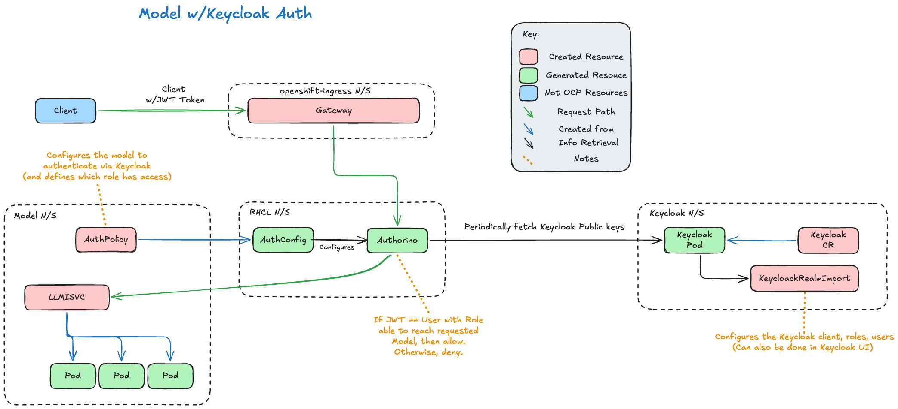
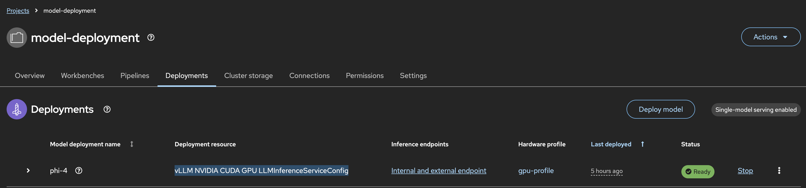

# LLM Auth With Keycloak 

## Scope

This demo is specifically for models deployed with Red Hat OpenShift AI, and an `LLMInferenceService` object. Models served with `InferenceService` and `ServingRuntime` objects will not use [Red Hat Connectivity Link (RHCL)](https://www.redhat.com/en/technologies/cloud-computing/connectivity-link), and therefore can't use the mechanisms described.

## Why?

When you're running your authenticated model on your OpenShift cluster, it's not always desirable for every user who uses the model, to also have credentials to the cluster itself.  That's where having some form of Identity and Access Management (IAM) solution, such as Keycloak, can help.

Keycloak allows a user to login to Keycloak, generate a JSON Web Token (JWT) and authenticate to the model with that. That way, no OpenShift user or service account tokens have to be generated and used, the user is effectively unknown to OpenShift.

## What?

The main component that goes into this is Authorino, installed by Red Hat Connectivity Link (RHCL). When you deploy a model onto OpenShift using the `LLMInferenceService` method, requests flow through the Gateway API.

The Gateway API has it's own Authorino `AuthPolicy` in the `openshift-ingress` namespace, that assumes all requests must be authenticated with an OpenShift token. However, if you create a new `AuthPolicy` in your deployed model's namespace that configures Keycloak authentication, this takes precedence.

A simplified request flow and arch diagram is shown below.



## How?

### Deployment Steps

* Deploy a model via the RHOAI UI as per usual. Ensure that is uses `llmInferenceService` objects, and not the `Legacy Deployment` method. Also ensure you **enable authentication**.

    

* Install and deploy Keycloak. A [helper repo](https://github.com/rh-aiservices-bu/ai-on-openshift/tree/main/docs/generative-ai/keycloak) is provided. This will install and configure Red Hat's Build of Keycloak (RHBK), into the `keycloak` namespace, using Kustomize. Just make sure you change the Keycloak Hostname in the CR.

    ```bash
    $ tail -n 6 keycloak.yaml
        hostname:
            hostname: keycloak.apps.<CLUSTER_DOMAIN> ### CHANGE_ME
            strict: false
            strictBackchannel: false
        proxy:
            headers: xforwarded

    $ oc apply -k keycloak/
    ```

* Next, we need to create the Keycloak Realm. This can be done either via the UI, or declaratively, such as below. This YAML is also [provided](https://github.com/rh-aiservices-bu/ai-on-openshift/tree/main/docs/generative-ai/keycloak/keycloakRealmImport.yaml).

    ```yaml
    apiVersion: k8s.keycloak.org/v2alpha1
    kind: KeycloakRealmImport
    metadata:
      name: llm-auth-realm
      namespace: keycloak
    spec:
      keycloakCRName: keycloak
      realm:
        realm: llm-auth                     #1
        enabled: true
        clients:
        - clientId: llm-client              #2
          enabled: true
          publicClient: true
          directAccessGrantsEnabled: true
          standardFlowEnabled: false
          roles:
          - name: auth-to-model             #3
        users:
        - username: alice                   #4
          firstName: Alice
          lastName: Test
          email: alice@test.com
          enabled: true
          requiredActions: []
          credentials:
          - type: password
            value: password
            temporary: false
          clientRoles:
            llm-client:
            - auth-to-model
        - username: bob                     #4
          firstName: Bob
          lastName: Test
          email: bob@test.com
          enabled: true
          requiredActions: []
          credentials:
          - type: password
            value: password
            temporary: false
    ```
    1) Think of Realms are separate environments (i.e. Dev, Prod, etc.) In this instance we have `llm-auth`.

    2) Clients would then represent individual applications within that environment - ours is `llm-client`.

    3) Roles define what a user can do within a Realm (Realm Role) or in a Client (Client Roles). We have a role called `auth-to-model`.

    4) Users are scoped to the Realm, and will be assigned Client Roles or Realm Roles, to define their access. In this example, we have Alice and Bob - however only Alice has the `auth-to-model` role.

* Finally, add in the `AuthPolicy` in the deployed model's namespace. You'll need to substitute in your `${MODEL_NAMESPACE}`, `${MODEL_NAME}` and `${KEYCLOAK_URL}`.

    ```yaml
    apiVersion: kuadrant.io/v1
    kind: AuthPolicy
    metadata:
    name: keycloak-authn
    namespace: ${MODEL_NAMESPACE}
    spec:
    targetRef:
      group: gateway.networking.k8s.io
      kind: HTTPRoute
      name: ${MODEL_NAME}-kserve-route
    rules:
      authentication:
        keycloak-jwt:
          jwt:
            issuerUrl: ${KEYCLOAK_URL}/realms/llm-auth
      authorization:
        model-access:
          patternMatching:
            patterns:
            - predicate: "'llm-client' in auth.identity.resource_access && 'auth-to-model' in auth.identity.resource_access['llm-client'].roles"  #1
      response:
        success:
          filters:
            identity:
              plain:
                expression: auth.identity
    ```
    1) This is Common Expression Language (CEL), that states the decoded JWT needs to have the "llm-client" dictionary, and in that, there needs to be a role called "auth-to-model". For context, here's that excerpt in Alice's JWT:

    ```bash
        "resource_access": {
            "llm-client": {
                "roles": ["auth-to-role"]
            }
        }
    ```

* Last thing to do is try it! A script has been provided in the [helper repo](https://github.com/rh-aiservices-bu/ai-on-openshift/tree/main/docs/generative-ai/keycloak/test-model.sh). Be sure to change the variables at the top!

    ```bash
    $ head -n5 test-model.sh
      # ---- Configuration ----
      KEYCLOAK_URL="https://keycloak.apps.<CLUSTER_DOMAIN>"
      MODEL_NAMESPACE="model-deployment"
      MODEL_NAME="<MODEL_NAME>"
      # -----------------------
    
    $ ./test-model.sh

      --- Alice ---
      HTTP 200
      --- Bob ---
      HTTP 403
    ```

### From the User's Perspective

Unfortunately, Keycloak doesn't provide a UI for users, like Bob and Alice, to retrieve their JWT.

For them to authenticate with the user, they have to retrieve their token via `curl`. Below is the example for Alice.

```bash
TOKEN=$(curl -s -X POST \
  https://${KEYCLOAK_URL}/realms/llm-auth/protocol/openid-connect/token \
  -H "Content-Type: application/x-www-form-urlencoded" \
  -d "client_id=llm-client" \
  -d "username=alice" \
  -d "password=password" \
  -d "grant_type=password" | jq -r '.access_token')
```

The token is then used to authenticate with the model, rather than using an OpenShift Token. i.e.

```bash
curl -s -X POST https://${MODEL_URL}/v1/chat/completions \
  -H "Authorization: Bearer ${TOKEN}" \
  -H "Content-Type: application/json" \
  -d '{
    "model": "${MODEL_NAME}",
    "messages": [{"role": "user", "content": "Hello!"}]
  }'
```

To provide a more user-friendly experience, a front-end application that handles logging in and the token on behalf of the user, can be used in between. This would be specific to the use-case of the model, for instance, a chatbot UI.  