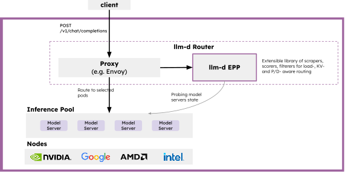
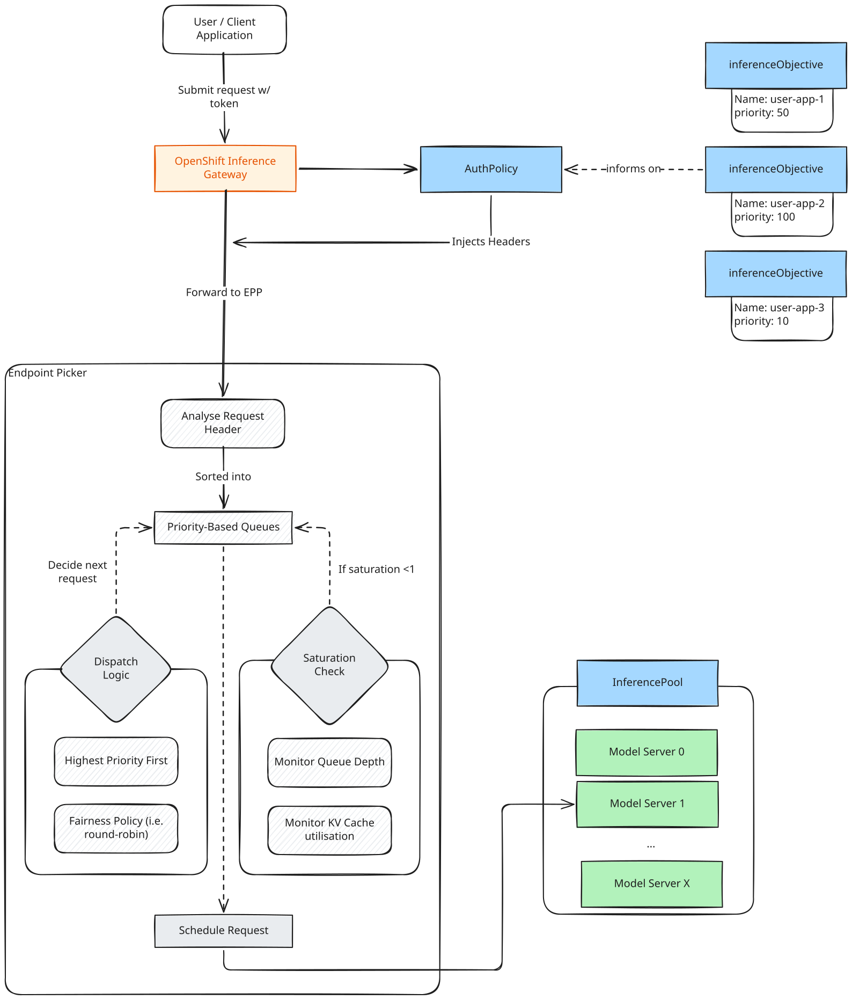

# llm-d

## Using llm-d on OpenShift

### What is it?

llm-d is a Kubernetes-native framework that speeds up distributed LLM inference at scale. It is able to orchestrate several model server pods, allowing key optimisations so you can serve high scale production traffic efficiently and reliably.

### How does it work?

The core components can be seen in the architectural diagram below[^1].



  - llm-d Router: The entrypoint for all inference requests.
    - Proxy: Accepts user requests, and determines the optimal destination model server based on the end point picker (EPP).
    - llm-d end point picker (EPP): The engine that will score and select model servers based on real-time metrics, [KV-Cache affinity](https://llm-d.ai/blog/kvcache-wins-you-can-see#the-precise-prefix-cache-scorer) and other policies.
  - Inference pool: Defines a group of model servers that share the same model and compute configuration. This is the discovery target for the router.

With these components, several key optimisations can be configured to significantly speed up inference requests, including:

  - Prefix cache locality - Requests can be routed to model server replicas that already have relevant KV-cache entries, reducing the latency by removing unnecessary prefill computation.
  - KV-cache utilisation - Requests are routed to model server replicas with more available memory.
  - Queue depth - Allows avoidance of overloaded / busy replicas.

[^1]: Image retrieved from the [llm-d documentation](https://llm-d.ai/docs/architecture#core-components).

### Quick Installation on OpenShift

Quick installation can be performed by following the [OpenShift AI documentation](https://docs.redhat.com/en/documentation/red_hat_openshift_ai_self-managed/latest/html/deploy_models_using_distributed_inference_with_llm-d/deploying-models-using-distributed-inference_distributed-inference#enabling-distributed-inference_distributed-inference) 

### Additional information:

Additional info surrounding the installation and usage of llm-d can be followed here:

  - [OpenShift AI documentation](https://docs.redhat.com/en/documentation/red_hat_openshift_ai_self-managed/latest/html/deploy_models_using_distributed_inference_with_llm-d/index)
  - [llm-d "Getting Started"](https://llm-d.ai/docs/getting-started)

## Advanced configuration

### llm-d Flow Control

#### Overview

llm-d Flow control is a configuration in the Endpoint Picker (EPP) that manages request queuing, prioritization and fairness in a multi-tenant inference serving environment. This configuration is particularly interesting when you have many tenant applications with different priorities and SLAs. With this, workloads can be prioritised over others to ensure maximum GPU utilisation, without affecting critical workload requests.

This works by injecting the request with headers so the EPP's dispatch logic can follow priority order, ensuring higher-priority requests dispatch before lower-priority requests. For requests in the same priority level, there's a **fairness policy** that determines which requests are executed on.

A saturation check will monitor the inferencePool. If saturation >=1, dispatching of requests will be halted and all requests will wait in their respective priority queues. Once capacity is available, the request will be scheduled to the specific model server.



Each request is injected with 2 headers by the Gateway's `authPolicy`.
  
  - `x-gateway-fairness-id` - Groups requests from the same authentication source.
  
  - `x-gateway-inference-objective` - Defines a priority by matching to an `inferenceObjective` object.

The prioritisation is determined by the authorization token in the request. This means that you must have enabled token-authorization for your llm-d model deployment. From this token, the user and namespace that the request is coming from can be found, which is required for setting these headers.

The `x-gateway-inference-objective` header is given a value based on 3 sources of tokens:

  1. User Tokens (i.e. `oc whoami --show-token`). This will set the header to `authenticated`.

  2. Anonymous Tokens. This will set the header to `unauthenticated`.

  3. ServiceAccount Tokens (i.e. `oc create token <sa-name> --duration=<duration>`). This will set the header to **the serviceAccount's namespace**.

#### Configuration

!!! note
    llm-d's flow control relies on an Authorization token in the request headers. Ensure you have [enabled auth](https://docs.redhat.com/en/documentation/red_hat_openshift_ai_self-managed/latest/html/deploy_models_using_distributed_inference_with_llm-d/enabling-authentication-and-authorization-for-llm-inference-service_distributed-inference) for your llm-d `llmInferenceService`.

Flow control is configured from the `llmInferenceService` object, specifically in the `EndpointPickerConfig` section.

```yaml
apiVersion: serving.kserve.io/v1alpha2
kind: LLMInferenceService
...
spec:
  ...
  router:
    ...
    scheduler:
      config:
        inline:
          apiVersion: inference.networking.x-k8s.io/v1alpha1
          kind: EndpointPickerConfig
          featureGates:
            - "flowControl"
          saturationDetector:
            queueDepthThreshold: 5
            kvCacheUtilThreshold: 0.8
            metricsStalenessThreshold: 200ms
```
The following metrics affect how the saturation detector works. The values listed are default:
  
  - `queueDepthThreshold`: Specifies the queue depth threshold on model servers. This refers to the number of requests in a queue of a _specific_ model server. This number is a trade off between shortening waiting time in the queue (by setting the number lower), and having a higher maximum throughput when batching requests many.
  
  - `kvCacheUtilThreshold`: The maximum utilisation of the KVCache, from 0.0 - 1.0. The default 0.8 refers to an 80% threshold.
  
  - `metricStalenessThreshold`: Specifies how long stale metrics are still considered valid. 

Optionally, you can configure advanced flow control settings within the same `EndPointPickerConfig`.

```yaml
...
      config:
        inline:
          apiVersion: inference.networking.x-k8s.io/v1alpha1
          kind: EndpointPickerConfig
          featureGates:
            - "flowControl"
          plugins:
            - type: fcfs-ordering-policy
            - type: round-robin-fairness-policy
          flowControl:
            ...
            priorityBands: ## For each priorityBand / inferenceObjective you make.
            - priority: 1
              orderingPolicyRef: fcfs-ordering-policy
              fairnessPolicyRef: round-robin-fairness-policy
```

For each priorityBand (identified by the `priority` value), you can specify the `orderingPolicyRef` and the `fairnessPolicyRef`. 

  - The `fairnessPolicy` is how to prioritise requests from different tenants, within the same `priorityBand`. The default value (`global-strict-fairness-policy`) can cause the "noisy neighbour" problem within the priorityBand. Setting this to `round-robin-fairness-policy` will isolate the tenants better and ensure an equitable service for both tenants.

  - The `orderingPolicy` determines how requests are queue within a specific flow. The default is First Come First Served (FCFS).

For each priorityBand, you'll also need to create an `inferenceObjective`. These need to be created in the same namespace as your `llmInferenceService` object.

```yaml
apiVersion: inference.networking.x-k8s.io/v1alpha2
kind: InferenceObjective
metadata:
  name: <name>
  namespace: <llmisvc-namespace>
spec:
  priority: 100
  poolRef:
    group: inference.networking.k8s.io
    kind: InferencePool
    name: <llmisvc-name>-inference-pool
```
The name of the `inferenceObjective` must be one of:
 
  - The namespace of the serviceAccount whose token will be used to inference with the model.

  - `authenticated`, for user tokens.

  - `unauthenticated`, for anonymous requests. 

All `inferenceObjectives` for a given llm-d deployed-model, need to be created within the same namespace as your `llmInferenceService` object. 

A higher `priority` value means a higher priority request.

#### Try it yourself

In [this repo](https://github.com/rh-aiservices-bu/llm-d-flowcontrol/tree/main/helm-chart) there's a helm chart to deploy an llm-d inference service, with flow control configured. More information on required configuration is in the README.md.

#### Appendix

  - [RHOAI Docs - Enabling auth for an LLM InferenceService](https://docs.redhat.com/en/documentation/red_hat_openshift_ai_self-managed/latest/html/deploy_models_using_distributed_inference_with_llm-d/enabling-authentication-and-authorization-for-llm-inference-service_distributed-inference)
  - [RHOAI Docs - Managing mixed workloads with priority queuing](https://docs.redhat.com/en/documentation/red_hat_openshift_ai_self-managed/latest/html/deploy_models_using_distributed_inference_with_llm-d/managing-mixed-workloads-with-priority-queuing)
