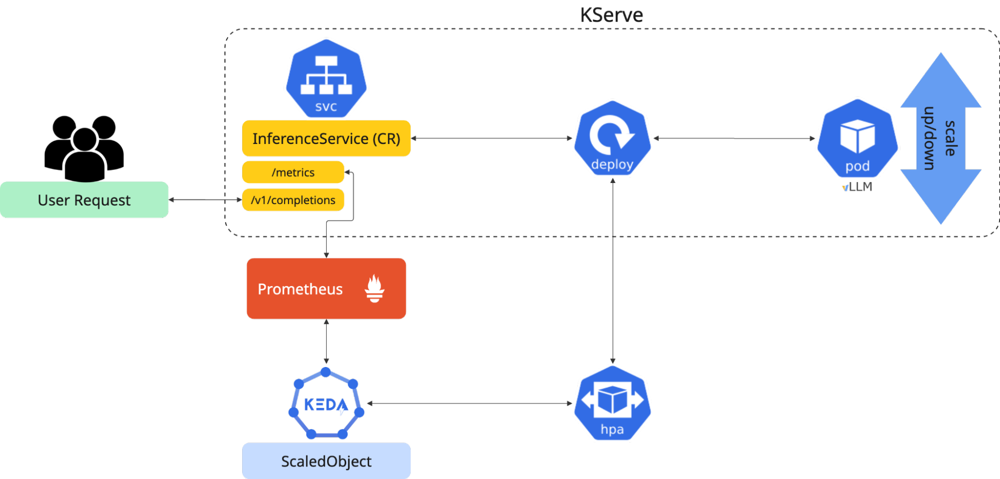
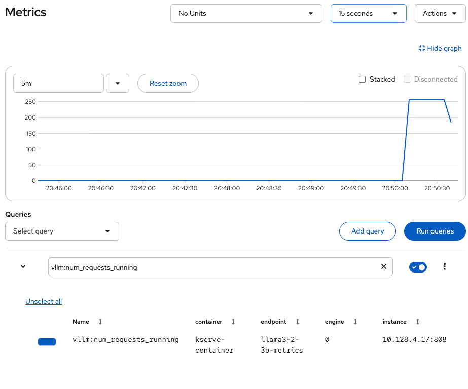
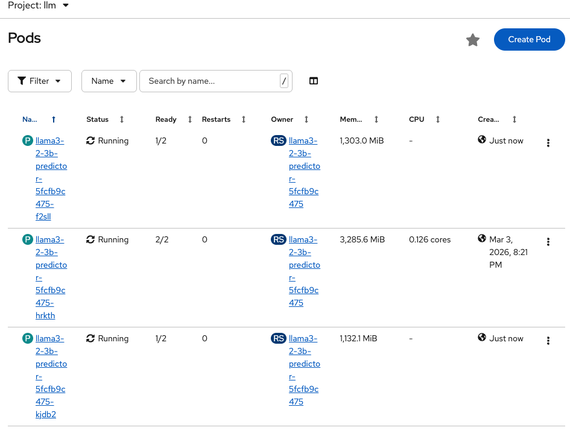

# Dynamic LLM Autoscaling with KEDA

Metrics-based autoscaling for LLM inference services on OpenShift AI using KEDA and vLLM metrics. Scale GPU workloads efficiently based on request queue depth.

This article is based on the [Dynamic Model Autoscaling Repository](https://github.com/rh-aiservices-bu/dynamic-model-autoscaling){:target="_blank"}, which contains Helm charts, demo scripts, and complete documentation.

## Why KEDA for LLM Autoscaling?

Deploying LLMs in production presents unique autoscaling challenges. Traditional CPU/memory-based autoscaling often falls short for LLM workloads because:

- **Unpredictable resource needs**: Processing time varies dramatically based on input/output sequence length
- **GPU utilization is misleading**: High GPU utilization might indicate efficient usage or a saturated, overloaded state
- **Request queue depth matters**: The number of waiting requests is a better indicator of when to scale

**KEDA** (Kubernetes Event-driven Autoscaling) solves this by scaling based on custom, application-specific metrics like vLLM's `num_requests_waiting` and `num_requests_running`.

!!! note "Knative vs RawDeployment"
    Knative autoscaling is not available in KServe RawDeployment mode. KEDA provides autoscaling capabilities for RawDeployment-based InferenceServices.

## Architecture



The autoscaling flow works as follows:

1. **vLLM** exposes metrics (`num_requests_waiting`, `num_requests_running`)
2. **ServiceMonitor** scrapes metrics into Prometheus via Thanos Querier
3. **KEDA** monitors the metrics and triggers scaling when thresholds are exceeded
4. **HPA** scales the deployment up or down based on KEDA's signals

!!! warning "Technology Preview"
    Metrics-based autoscaling is currently available in Red Hat OpenShift AI as a **Technology Preview** feature.For more information, see [Technology Preview Features Support Scope](https://access.redhat.com/support/offerings/techpreview){:target="_blank"}.

### Automatic KEDA Integration

Setting the annotation `serving.kserve.io/autoscalerClass: keda` on your InferenceService triggers **odh-model-controller** to automatically create:

- TriggerAuthentication, ServiceAccount, Role, RoleBinding, Secret
- ScaledObject with Prometheus trigger

No manual KEDA configuration is required.

## Key Metrics for Autoscaling

Query vLLM metrics in the OpenShift Console (Observe → Metrics):

```promql
# Requests waiting in queue (triggers scale-up)
sum(vllm:num_requests_waiting{model_name="<model-name>"})

# Active requests being processed
sum(vllm:num_requests_running{model_name="<model-name>"})
```



**Expected behavior:**

- **Scale-up**: Pods increase within ~30-60 seconds when request queue grows
- **Scale-down**: Pods return to minimum after ~5 minutes cooldown when load stops



## Getting Started

### Quick Install

Clone the repository and deploy the components using Helm:

```bash
git clone https://github.com/rh-aiservices-bu/dynamic-model-autoscaling.git
cd dynamic-model-autoscaling

# 1. Install KEDA Operator
oc create namespace openshift-keda
oc label namespace openshift-keda openshift.io/cluster-monitoring=true
helm install keda-operator helm/keda-operator/ -n openshift-keda

# 2. Enable User Workload Monitoring
helm install uwm helm/uwm/ -n openshift-monitoring

# 3. Configure KEDA Controller
helm install keda helm/keda/ -n openshift-keda

# 4. Deploy a model with KEDA autoscaling enabled
export NAMESPACE=autoscaling-keda
oc new-project $NAMESPACE
helm install llama3-2-3b helm/llama3.2-3b/ \
  --set keda.enabled=true \
  --set inferenceService.maxReplicas=3 \
  -n $NAMESPACE
```

### Verify Autoscaling

```bash
# Check KEDA resources were created
oc get scaledobject,hpa,pods -n $NAMESPACE

# Run the included load test to trigger scaling
DURATION=60 RATE=20 NAMESPACE=$NAMESPACE ./scripts/basic-load-test.sh
```

### Repository Contents

For complete documentation, additional models, and advanced configurations, see:

- [Dynamic Model Autoscaling Repository](https://github.com/rh-aiservices-bu/dynamic-model-autoscaling){:target="_blank"}

The repository includes:

- Helm charts for KEDA operator, controller, and model deployments
- Pre-configured InferenceServices for Llama 3.2-3B and Granite 3.3-8B
- Load testing scripts to verify autoscaling behavior
- KEDA HTTP Add-on setup for scale-to-zero

## Scale-to-Zero

Standard Prometheus-based KEDA cannot scale to zero because when no pods are running, no metrics are generated. This creates a chicken-and-egg problem: KEDA needs metrics to scale up, but metrics only exist when pods are running.

For scale-to-zero capabilities, the **KEDA HTTP Add-on** provides a solution by intercepting HTTP requests before they reach the service:

1. The HTTP Add-on interceptor sits in front of your service
2. When pods are at zero, incoming requests are held by the interceptor
3. The interceptor triggers KEDA to scale up from 0 → 1
4. Once the pod is ready, requests are forwarded to the model

!!! note "Scale-to-Zero Trade-off"
    First request after scale-to-zero takes 60-90 seconds while the model loads. This is suitable for cost optimization but not for latency-sensitive workloads.

For detailed setup instructions, see the [KEDA HTTP Add-on Demo Guide](https://github.com/rh-aiservices-bu/dynamic-model-autoscaling/blob/main/assets/docs/demo-http-addon.md){:target="_blank"}.

## Reference Material

- [Red Hat OpenShift AI Documentation - Metrics-based Autoscaling](https://docs.redhat.com/en/documentation/red_hat_openshift_ai_self-managed/3.2/html/managing_and_monitoring_models/managing_and_monitoring_models#configuring-metrics-based-autoscaling_cluster-admin){:target="_blank"}
- [KEDA Documentation](https://keda.sh/docs/){:target="_blank"}
