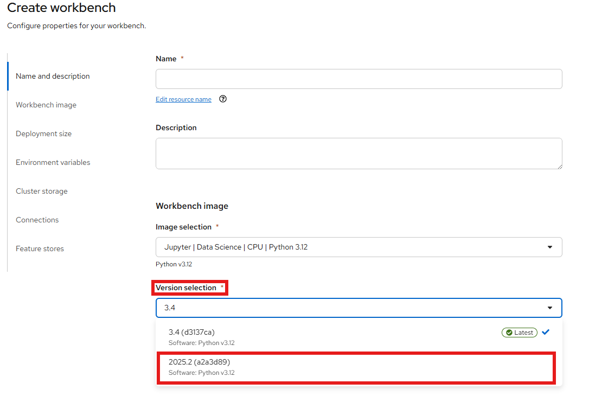
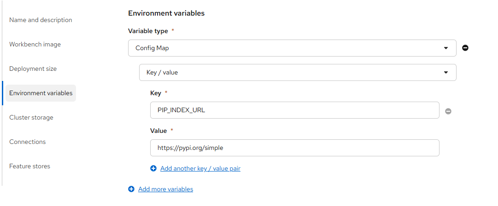

# Python Packages in OpenShift AI Workbenches

When you work inside an OpenShift AI workbench, you have access to a Python environment that comes pre-loaded with a set of common data science and machine learning libraries. But what happens when you need something that isn't already there?  
This page explains how package management works in workbenches, what changed in recent versions of OpenShift AI, and what your options are when you run into a gap.

## The Red Hat AI Python Index

Starting with OpenShift AI 3.4, workbench images are configured to pull Python packages from the **Red Hat AI Python Index** rather than directly from [PyPI](https://pypi.org) (the default public Python package index).
This new index is a curated collection of Python packages that have been built, tested, and shipped by Red Hat.

The key benefit of this approach is a **secure software supply chain**. Every package in the index has been vetted and built from source by Red Hat, which reduces exposure to supply chain attacks, tampered packages, and untrusted dependencies that can affect PyPI-hosted packages. For enterprise environments and regulated industries, this is a significant advantage.

Another important detail: the index ships its own **custom CUDA builds** of GPU-accelerated packages like PyTorch. These builds are compiled and tested against the specific CUDA version included in the workbench image, ensuring that everything works together reliably out of the box.

## The CUDA Compatibility Problem

If you decide to install a GPU-accelerated package from an index other than the RH AI Python Index while using a CUDA-enabled workbench image, you are very likely to run into trouble.

!!! warning "Do not mix CUDA builds"
    The CUDA libraries baked into the workbench image are built to match the specific CUDA versions that we build and ship in the RH AI Python Index. A GPU-accelerated package from PyPI is compiled against a specific CUDA version and expects to find a compatible one at runtime. If that does not match the CUDA version in the workbench image, you will likely see crashes, silent failures, or subtle numerical errors that are difficult to debug. If you are using GPU-accelerated packages, stick to one index.

Pure Python packages or packages with no CUDA dependencies are generally fine to install from PyPI even on a CUDA-enabled image, since they do not interact with the GPU stack at all. The risk is specific to packages that link against CUDA at runtime, such as PyTorch, CuPy, or RAPIDS.

## What to Do When a Package Is Not Available

The RH AI Python Index currently contains around 1,285 packages focused on machine learning, data processing, and LLM-related workloads. That is a small fraction of the 800,000+ packages available on PyPI, so there will be cases where something you need is not there.  
If that happens, you have a few options.

### Option 1: Request the Package

If the package you need is missing but would be a good fit for the index, you can request it to be added by opening a support ticket with Red Hat.

This is the recommended path if you are working in an environment where supply chain security matters, since it keeps you on the fully supported stack.

### Option 2: Switch to the 2025.2 Workbench Image

The workbench images from OpenShift AI 2025.2 point to PyPI, giving you access to the full public package index. If you need a package that isn't in the RH AI Python Index and you require it faster than a request can provide, you can switch your workbench to one of the 2025.2 images.

To change the workbench image, open your data science project in the OpenShift AI dashboard, stop the workbench, and edit it. In the workbench settings, look for the **Workbench image** section and select a 2025.2 version of the image you are currently using.

### Option 3: Override the pip Index via an Environment Variable

If you want to keep your current workbench image but still pull packages from PyPI (or any other index), you can override the pip index URL by setting the `PIP_INDEX_URL` environment variable on your workbench.

To do this, stop the workbench first, then go into the workbench settings and add an environment variable:

| Variable | Value |
|---|---|
| `PIP_INDEX_URL` | `https://pypi.org/simple` |

After saving and restarting the workbench, any `pip install` command will use PyPI instead of the RH AI Python Index.

!!! tip
    You can also set `PIP_INDEX_URL` to point to any other compatible index, such as a private Artifactory or Nexus instance. This is particularly useful in disconnected environments where you maintain your own internal mirror.

!!! warning
    The same CUDA compatibility caveat applies here. If your workbench uses a CUDA-enabled image, installing CUDA-dependent packages from an external index may cause incompatibilities. Use this option with care for GPU workloads.

## Summary

| Option | Package Coverage | Secure Supply Chain | CUDA Safe |
|---|---|---|---|
| RH AI Python Index (default) | Limited (request to add more) | Yes | Yes |
| Switch to 2025.2 image | Full PyPI | No | Yes |
| Override `PIP_INDEX_URL` | Full PyPI or custom index | Partial | No (GPU risk) |

## Additional Resources

- [Red Hat AI Python Index - OpenShift AI 3.4](https://console.redhat.com/api/pypi/public-rhai/rhoai/3.4/cpu-ubi9/simple/){:target="_blank"} - Browse all available packages in the 3.4 CPU index
- [Article About the Red Hat AI Python Index](https://access.redhat.com/articles/7137881){:target="_blank"} - Red Hat article covering the index, supported base images, and package categories
- [How to install packages from a PyPI mirror in disconnected RHOAI environments](https://access.redhat.com/solutions/7046270){:target="_blank"} - Red Hat Customer Portal
